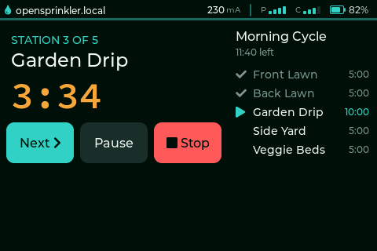
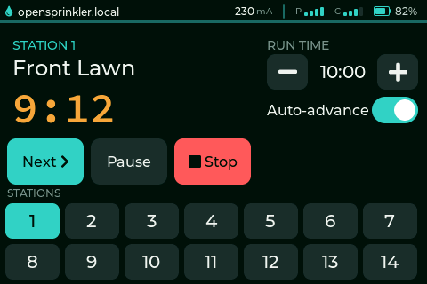
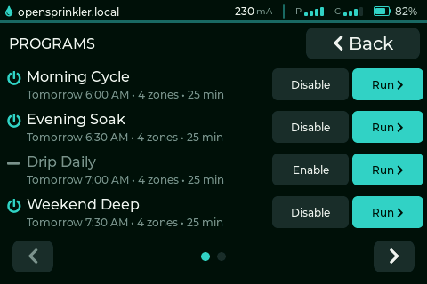
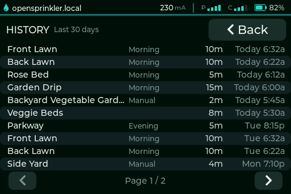

<h1 align="center">OpenSprinkler Panel</h1>

<p align="center">
  A 3.5" touch panel for running and stepping <a href="https://opensprinkler.com/">OpenSprinkler</a> stations and programs.<br>
  Local control directly to your OpenSprinkler controller over its HTTP API, on your own network.
</p>

<p align="center">
  <a href="https://www.nullmethod.com/opensprinkler-panel/"></a>
  &nbsp;&nbsp;
  <a href="https://www.nullmethod.com/opensprinkler-panel/flash/"></a>
</p>

<p align="center">
  
</p>

New to OpenSprinkler? It's an open-source sprinkler/irrigation controller; learn more at [opensprinkler.com](https://opensprinkler.com/).

## Features

- Run a single station for an adjustable run time, then Stop or Advance to the next.

  

- Auto-advance through the stations for a bounded pass of the whole yard.

- See and run programs stored on the controller: name, next run, zone count, and total minutes.

  

- Drive a running program with a live queue: advance, pause/resume, or stop, reflected against the controller's state.

- Review recent runs in a paged History log: every station run and event from the controller, including scheduled programs and app-initiated runs.

  

## Supported hardware

Hosyond 3.5" ESP32 display (SKU E32R35T, community name ESP32-3248S035R, a "CYD"). The same board is sold under several brands; validated on the Hosyond unit:

- Buy it (affiliate link, supports the project): <https://link.amazon/B072rCpB0>
- Buy it (non-affiliate): <https://www.amazon.com/dp/B0D93MBWC2>
- Reference wiki: <https://www.lcdwiki.com/3.5inch_ESP32-32E_Display>

Classic ESP32-WROOM-32E (no PSRAM, 4 MB flash), ST7796U 480x320 display, XPT2046 resistive touch on the same SPI bus, USB-C 5 V power. Use the resistive touch version; capacitive variants aren't supported yet. Full detail in the [hardware guide](https://www.nullmethod.com/opensprinkler-panel/hardware/) and the pin map in [`docs/03-architecture.md`](docs/03-architecture.md).

## Flash it in your browser

Install the latest firmware from a Chromium browser (Chrome or Edge):

<https://www.nullmethod.com/opensprinkler-panel/flash/>

Then follow [first-boot setup](https://www.nullmethod.com/opensprinkler-panel/configuration/) to enter Wi-Fi plus your OpenSprinkler host and device password. The [user manual](https://www.nullmethod.com/opensprinkler-panel/) covers flashing, configuration, usage, updating, and troubleshooting.

---

## Development

Firmware built with PlatformIO on the stock `espressif32@7.0.1` platform, Arduino framework, TFT_eSPI (ST7796U display and XPT2046 touch), LVGL 9, WiFiManager, ArduinoJson, and Preferences (NVS).

The design docs under [`docs/`](docs/) are the in-repo source of truth; start with [`docs/README.md`](docs/README.md). Bench and flash tooling is documented in [`tools/README.md`](tools/README.md).

### Project layout

```
docs/          Design docs, the source of truth (read docs/README.md first)
src/           Firmware entry point (hardware glue: display/touch/LVGL/WiFi)
lib/           Hardware-independent domain logic (pure C++, native-testable)
sim/           Host LVGL UI simulator: renders lib/ui screens to PNG (env:sim)
test/          Native (host) unit tests, run in CI, no board needed
tools/         Local flash & debug helpers (see tools/README.md)
docs/mock_os.py  OpenSprinkler controller emulator for developing without hardware
platformio.ini   Build config: cyd-35r (firmware) + native (tests)
```

Hardware-independent logic (domain models, API client, parsing, state machines) lives in `lib/*` as pure C++ with injected transports, so it's covered by native Unity tests; Arduino/hardware glue stays thin in `src/`.

### Building & testing

> Builds and tests run in CI and cloud sessions, not on a local machine. The ESP32 toolchain is pinned in `platformio.ini`, so every environment builds identically.

```bash
pio test -e native      # hardware-independent unit tests
pio run  -e cyd-35r     # compile the firmware
```

`.github/workflows/ci.yml` runs the native tests, compiles the firmware, and publishes a flashable `cyd-35r-firmware` artifact on every push/PR; `release.yml` publishes release binaries (including `merged-firmware.bin`, which the hosted browser flasher installs) on a `v*` tag; `zizmor.yml` security-audits the workflows themselves; and `copilot-setup-steps.yml` pre-installs the same toolchain for cloud sessions. Full CI/CD reference in [`docs/07-ci-cd-and-releases.md`](docs/07-ci-cd-and-releases.md).

### Iterate on the UI without hardware

A host LVGL simulator renders the **real firmware screen code** (`lib/ui`) to 480×320 PNGs on your machine, using the **same `lv_conf.h` and Montserrat fonts as the ESP32 build** — so what you see is what the panel draws, with no board and no flashing.

```bash
brew install sdl2                                       # or: apt-get install -y libsdl2-dev
pio run -e sim                                          # build the host sim
SDL_VIDEODRIVER=dummy ./.pio/build/sim/program          # render every state -> sim/out/*.png
./.pio/build/sim/program --window --state history-list  # or preview one state in a live window
```

Every screen/state is driven from portable view-model fixtures (`sim/fixtures.cpp`): the idle prompt (connected / loading / syncing / reconnecting / offline / auth), the unified run screen (manual and program, running and paused), the programs list, the History log, and sleep. This is also how the user-manual screenshots are rendered. See [`sim/README.md`](sim/README.md) and [`docs/09-ui-simulator.md`](docs/09-ui-simulator.md).

### Flashing & debugging locally

[`tools/flash.sh`](tools/flash.sh) downloads a branch/PR/release build and writes `merged-firmware.bin` over USB (`--release` grabs the latest release); [`tools/ota.sh`](tools/ota.sh) pushes updates over Wi-Fi; [`tools/panel.py`](tools/panel.py) pulls pixel-exact screenshots and injects synthetic touch. See [`tools/README.md`](tools/README.md) for the full workflow.

### Develop without the controller

```bash
python3 docs/mock_os.py            # serves the OpenSprinkler API on :8080 (24 fake stations, programs)
python3 docs/mock_os.py --schedule # also fire programs at their scheduled start times
python3 docs/test_mock_os.py       # run the emulator's contract/connection tests
```

Point the panel's configured host at `your-machine-ip:8080`. The emulator serves every endpoint the firmware uses (`/jn`, `/jo`, `/jc`, `/js`, `/jp` and `/cm`, `/cv`, `/mp`, `/cp`, `/pq`) and models the sequential run queue, programs, pause, and the `en=1`-on-running-station no-op.

### Documentation site

The public user manual lives under [`site/`](site/) (Just the Docs, Jekyll) and deploys to GitHub Pages via `.github/workflows/pages.yml`. The `docs/` folder is the developer source of truth and is not published to the site. See [`docs/08-docs-site.md`](docs/08-docs-site.md) for how to maintain the manual, flasher, and Pages build.
