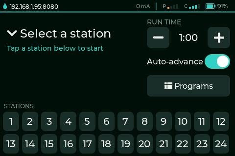

# OpenSprinkler Station Control Panel

A wall-mounted 3.5″ touch panel that runs and steps through your OpenSprinkler
**stations** and **programs** locally — for seasonal blow-out, spring testing,
and everyday manual runs — with **no phone, app, or cloud account**. It talks
directly to your OpenSprinkler controller over its local HTTP API on your own
network.



📖 **[User manual](https://gregose.github.io/opensprinkler-panel/)** ·
⚡ **[Flash it in your browser](https://gregose.github.io/opensprinkler-panel/flash/)**

## Features

- **Run a single station** for an adjustable run time, then Stop or Advance to
  the next one.

  

- **Auto-advance** through your stations for a bounded pass of the whole yard.

- **See and run programs** stored on the controller — name, next run, zone
  count, and total minutes at a glance.

  

- **Drive a running program** with a live queue — advance, pause/resume, or
  stop — all reflected against the controller's real state.

  

The panel is a thin client: your OpenSprinkler controller stays the source of
truth. Nothing leaves your LAN.

## Supported hardware

LCDwiki **3.5″ ESP32-32E Display** (SKU **E32R35T**, community name
**ESP32-3248S035R**, a "CYD"):

- **Product page:** <https://www.lcdwiki.com/3.5inch_ESP32-32E_Display>
- **Buy it:** <https://www.amazon.com/dp/B0D93MBWC2>

Classic **ESP32-WROOM-32E** (no PSRAM, 4 MB flash), **ST7796U** 480×320 display,
**XPT2046 resistive** touch on the same SPI bus, USB-C 5 V power. Get the
**resistive** touch version; capacitive variants aren't supported yet. Full
detail in the [hardware guide](https://gregose.github.io/opensprinkler-panel/hardware/)
and the pin map in [`docs/03-architecture.md`](docs/03-architecture.md).

## Flash it in your browser

Install the latest firmware straight from a Chromium browser (Chrome/Edge) —
nothing to download:

👉 **<https://gregose.github.io/opensprinkler-panel/flash/>**

Then follow [first-boot setup](https://gregose.github.io/opensprinkler-panel/configuration/)
to enter Wi-Fi plus your OpenSprinkler host and device password. The complete
[user manual](https://gregose.github.io/opensprinkler-panel/) covers flashing,
configuration, usage, updating, and troubleshooting.

---

## Development

Firmware built with PlatformIO · stock **`espressif32@7.0.1`** platform ·
Arduino framework · **TFT_eSPI** (ST7796U display + XPT2046 touch) · **LVGL 9** ·
WiFiManager · ArduinoJson · Preferences (NVS).

The design docs under [`docs/`](docs/) are the in-repo source of truth — start
with [`docs/README.md`](docs/README.md). Bench/flash tooling is documented in
[`tools/README.md`](tools/README.md).

### Project layout

```
docs/          Design docs — the source of truth (read docs/README.md first)
src/           Firmware entry point (hardware glue: display/touch/LVGL/WiFi)
lib/           Hardware-independent domain logic (pure C++, native-testable)
test/          Native (host) unit tests — run in CI, no board needed
tools/         Local flash & debug helpers (see tools/README.md)
docs/mock_os.py  OpenSprinkler controller emulator for developing without hardware
platformio.ini   Build config: cyd-35r (firmware) + native (tests)
```

Hardware-independent logic (domain models, API client, parsing, state machines)
lives in `lib/*` as pure C++ with injected transports, so it's covered by native
Unity tests; Arduino/hardware glue stays thin in `src/`.

### Building & testing

> Builds and tests run in **CI and cloud sessions**, not on a local machine.
> The ESP32 toolchain is pinned in `platformio.ini`, so every environment builds
> identically.

```bash
pio test -e native      # hardware-independent unit tests
pio run  -e cyd-35r     # compile the firmware
```

`.github/workflows/ci.yml` runs the native tests, compiles the firmware, and
publishes a flashable `cyd-35r-firmware` artifact on every push/PR;
`release.yml` publishes release binaries (including `merged-firmware.bin`, which
the hosted browser flasher installs). `copilot-setup-steps.yml` pre-installs the
same toolchain for cloud sessions.

### Flashing & debugging locally

[`tools/flash.sh`](tools/flash.sh) downloads a branch/PR/release build and
writes `merged-firmware.bin` over USB (`--release` grabs the latest release);
[`tools/ota.sh`](tools/ota.sh) pushes updates over Wi-Fi;
[`tools/panel.py`](tools/panel.py) pulls pixel-exact screenshots and injects
synthetic touch. See [`tools/README.md`](tools/README.md) for the full workflow.

### Develop without the controller

```bash
python3 docs/mock_os.py            # serves the OpenSprinkler API on :8080 (24 fake stations, programs)
python3 docs/mock_os.py --schedule # also fire programs at their scheduled start times
python3 docs/test_mock_os.py       # run the emulator's contract/connection tests
```

Point the panel's configured host at `your-machine-ip:8080`. The emulator serves
every endpoint the firmware uses (`/jn`, `/jo`, `/jc`, `/js`, `/jp` and `/cm`,
`/cv`, `/mp`, `/cp`, `/pq`) and models the sequential run queue, programs, pause,
and the `en=1`-on-running-station no-op.

### Documentation site

The public user manual lives under [`site/`](site/) (Just the Docs, Jekyll) and
deploys to GitHub Pages via `.github/workflows/pages.yml`. The `docs/` folder is
the developer source of truth and is **not** published to the site.
